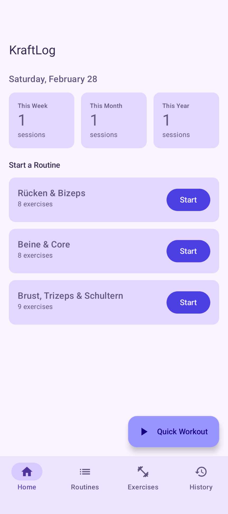
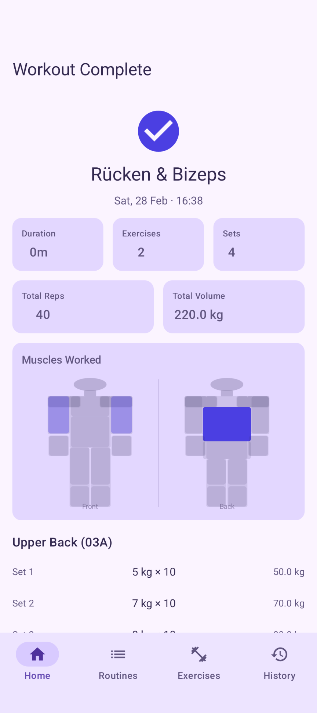
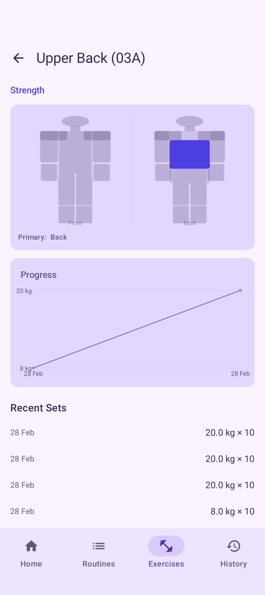

# KraftLog

A local-first Android workout tracking app built with Jetpack Compose and Material3.

## Features

- **Exercise Library** — 31 pre-loaded exercises across Strength, Cardio, Calisthenics, Flexibility, and Plyometrics categories. Add your own custom exercises.
- **Routine Builder** — Create reusable workout templates with exercises, target sets/reps/weight, and rest time.
- **Strength Workouts** — Start a session from any routine or as a quick ad-hoc workout. Log sets with weight and reps in real time with an elapsed timer.
- **Running Workouts** — Track runs with a live timer and log distance and notes on completion.
- **Bouldering Workouts** — Log boulder problems by grade, track attempts and sends during a session.
- **History & Progress** — Browse past sessions grouped by month, view total volume per session, and track set history per exercise.
- **Home Screen Widget** — Glance-powered widget to start a workout or view recent activity at a glance.

All data is stored locally — no account or internet connection required.

## Screenshots





## Tech Stack

| Layer | Technology |
|---|---|
| Language | Kotlin 2.3.10 |
| UI | Jetpack Compose + Material3 |
| Navigation | Navigation Compose 2.9.7 |
| Database | Room 2.8.4 |
| Annotation Processing | KSP 2.3.6 |
| State Management | ViewModel + StateFlow |
| Background Work | WorkManager 2.10.1 |
| App Widget | Glance 1.1.0 |
| Build | AGP 9.0.1, Gradle version catalog |

## Architecture

```
app/
└── src/main/java/de/nyxnord/kraftlog/
    ├── KraftLogApplication.kt       # Manual DI container
    ├── MainActivity.kt              # Entry point
    ├── data/
    │   ├── local/
    │   │   ├── entity/              # Room entities
    │   │   ├── dao/                 # Data access objects
    │   │   ├── relation/            # Room relation classes
    │   │   ├── Converters.kt        # Type converters
    │   │   └── KraftLogDatabase.kt  # Database + seed data
    │   └── repository/              # Repository layer
    └── ui/
        ├── navigation/              # NavHost + route definitions
        ├── home/                    # Dashboard + FAB session picker
        ├── routines/                # Routine list, detail, edit
        ├── exercises/               # Exercise library + detail
        ├── workout/                 # Active, running, bouldering sessions + summary
        └── history/                 # Session history + detail
```

The app follows a straightforward data → repository → ViewModel → Composable pattern. Dependency injection is handled manually via `KraftLogApplication`, which lazily initializes the Room database and exposes repository instances. No Hilt or Dagger.

## Database Schema

| Table | Description |
|---|---|
| `exercises` | Exercise definitions (seeded + user-created) |
| `routines` | Workout templates |
| `routine_exercises` | Exercises within a routine with targets |
| `workout_sessions` | Individual workout sessions (STRENGTH, RUNNING, BOULDERING) |
| `workout_sets` | Logged sets within a session |

## Requirements

- Android 16 (API 36) or higher
- Android Studio Meerkat or newer

## Building

1. Clone the repository
2. Open in Android Studio
3. Sync Gradle (`File → Sync Project with Gradle Files`)
4. Run on a device or emulator running Android 16+

```bash
./gradlew assembleDebug
```
